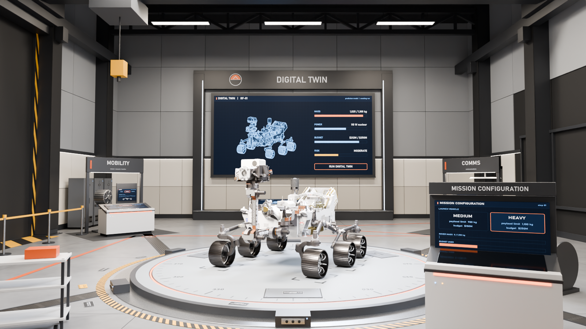
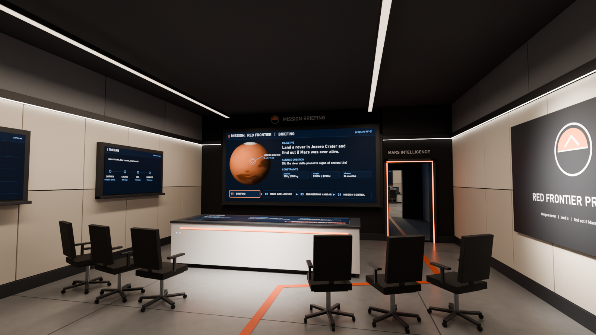
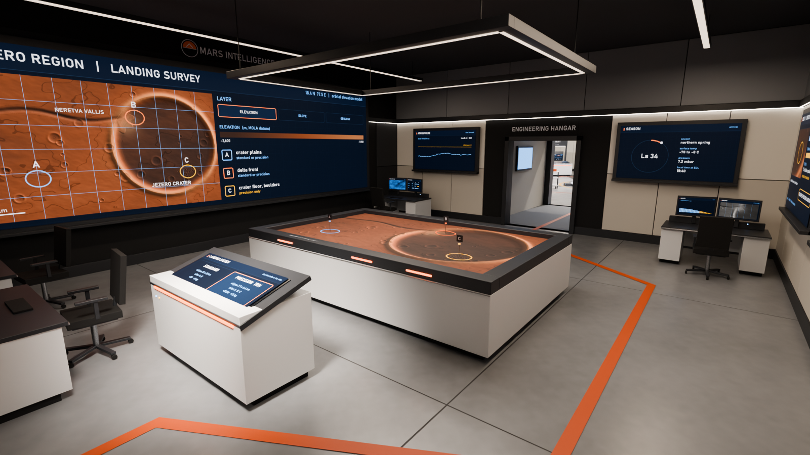
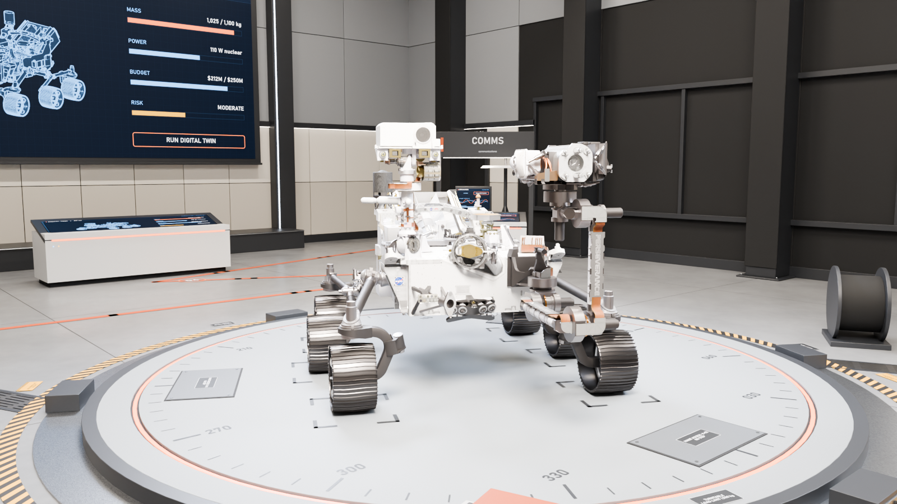
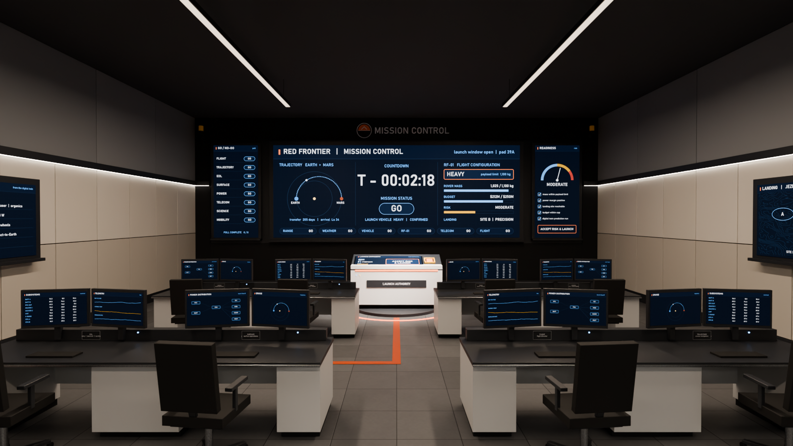

# RED FRONTIER

### A Mars mission-design game by Team AUSThir | NASA Space Apps Challenge 2026

Build a rover around a science question, choose where it lands, then find out whether the mission can survive Mars.

<p align="center">
  
</p>

**Red Frontier** is a mission-design game about making connected engineering and science decisions under uncertainty. The intended experience follows a mission from its first briefing through site selection, rover design, simulation, launch, surface operations, and a final explanation of the outcome.

> This is an independent student project created for NASA Space Apps Challenge 2026. It is not a NASA product and is not endorsed by NASA.

## The Mission

The player starts with a science objective, not a prebuilt rover. Every later decision should serve that objective and respond to Mars conditions.

1. **Understand the mission.** Read the science question, constraints, and success criteria in the Briefing room.
2. **Choose a landing strategy.** Compare landing systems and candidate sites using terrain, science value, sunlight, and risk. The current site-selection values are prototypes; source-backed values are part of the planned data integration.
3. **Engineer the rover.** Select power, battery, shielding, communications, mobility, and science instruments. Trade mass, budget, power demand, capability, and risk.
4. **Test the design.** Run the Digital Twin against the chosen site and mission conditions. Use its prediction to revise the rover before committing.
5. **Accept the risk and launch.** Review the mission readiness picture and make the launch decision.
6. **Operate on Mars.** Drive to science targets, manage energy and communications, respond to dust and other hazards, and decide when to preserve the rover versus press on.
7. **Learn from the outcome.** See what the rover achieved, which decisions mattered, and how the result compares with real mission evidence.

The game is being built in stages. The complete mission above is the project goal; the current playable build is a facility-and-rover-configuration prototype. Planned systems are described as plans, not as completed gameplay.

## Visual Tour

<table>
  <tr>
    <td></td>
    <td></td>
  </tr>
  <tr>
    <td></td>
    <td></td>
  </tr>
</table>

## Gameplay Recordings

- [Watch the first-person facility and mission flow](renders/demo/Red_Frontier_Gameplay_FPP.mp4)
- [Watch the third-person facility and mission flow](renders/demo/Red_Frontier_Gameplay.mp4)

Both recordings show the current prototype, not the complete planned Mars-driving game.

## What Is Playable Now

- Six connected 3D facility spaces, streamed as the player walks: Briefing, Corridor 01, Mars Intelligence, Corridor 02, Engineering Hangar, and Mission Control.
- First- or third-person facility traversal, interaction prompts, briefing flow, and landing-site selection.
- A rover configuration panel with live mass, budget, power, safety, and science trade-offs.
- A reference-guided, Perseverance-inspired rover displayed in the Engineering Hangar.
- Automated gameplay coverage for the facility route, mission interactions, and rover-build rules.

Landing-site scores and rover configuration values are game prototypes. They are not NASA measurements or engineering specifications. A true Digital Twin evaluation, launch handoff, Mars driving, science collection, hazard play, and results loop remain planned.

## Project Structure

| Path                      | Purpose                                                                      |
| ------------------------- | ---------------------------------------------------------------------------- |
| `godot/`                  | Playable Godot project, streamed facility, UI, and game systems              |
| `blender/` and `scripts/` | Facility source scenes, procedural builders, exports, and validation         |
| `assets/rover/`           | Rover wrapper and Godot runtime asset                                        |
| `art/`                    | Rover modeling work, exports, reference credits, and QA reports              |
| `docs/`                   | Game concept, roadmap, data strategy, visual language, and readiness reports |
| `renders/`                | Facility review images and gameplay recordings                               |

See the [documentation index](docs/README.md) for the design brief, data provenance, asset integration, and test evidence.

## Run the Prototype

### Requirements

- Godot 4.7
- Windows, macOS, or Linux with a Vulkan-capable GPU; integrated-GPU quality settings are selected automatically where supported.

Clone the repository, open the `godot/` folder in Godot, and run the project. From a terminal at the repository root:

```sh
godot --path godot
```

To start in first person:

```sh
godot --path godot -- fpp
```

**Controls:** WASD to move, Shift to run, mouse to look, E to interact, Esc to release the mouse (click to capture again). F3 toggles streaming diagnostics.

The standalone facility viewer is available with:

```sh
godot --path godot res://viewer/hangar_viewer.tscn
```

On Windows, `Open_Hangar_In_Godot.bat` is a convenience launcher. Set `GODOT_EXE` to a Godot 4.7 executable path if it is not on `PATH`.

## Verify

Run from the repository root:

```sh
godot --path godot -- gameplay_test full
godot --headless --path godot --script res://tests/rover_build_test.gd
node art/qa/verify_perseverance_export.cjs
node art/qa/verify_exports.cjs
```

The gameplay test traverses the full facility route and exercises the current mission UI. The Node.js export checks cover the detailed Perseverance-inspired model and the separate preserved hybrid baseline.

## Build the Facility Assets

The checked-in Godot project can be run without rebuilding the Blender source. To regenerate facility textures and assets, install Python with NumPy and Pillow, Blender, and Godot 4.7, then use the scripts under `scripts/`:

```sh
python -m pip install numpy Pillow
python scripts/gen_textures.py
blender -b --factory-startup --python scripts/build_facility.py
blender -b blender/RF_Facility.blend --python scripts/validate_scene.py
blender -b blender/RF_Facility.blend --python scripts/export_material_library.py
blender -b blender/RF_Facility.blend --python scripts/export_gltf.py -- Hangar
python scripts/godot_sync.py
```

Repeat the GLB export command for `Briefing`, `Corridor01`, `MarsIntel`, `Corridor02`, and `MissionControl` as needed. See [the facility plan](docs/PLAN.md) before rebuilding locked environments.

## Mars Data and Evidence

The design goal is to make consequential gameplay decisions traceable to planetary and mission data. The repository contains a research ledger and candidate sources for terrain, weather, dust storms, rover performance, and communications. Researching a dataset does not mean it is already integrated into the game.

- Current landing-site values are marked `PROTOTYPE` in [`landing_sites.json`](godot/game/data/landing_sites.json).
- The [data ledger](docs/DATA_LEDGER.md) separates the intended data-driven game from current prototype behavior and tracks source checks, licensing, and integration work.
- The [data-source register](docs/DATA_SOURCES.md) links NASA, JPL, USGS, ESA, and research sources.
- Rover model references, credits, and fidelity limits are documented in the [Perseverance build report](art/qa/PERSEVERANCE_BUILD_REPORT.md).

## Team AUSThir

- Md Tayeb Ibne Sayed
- Fairuz Anadi
- Samprity Haque
- Syed Mohammed Sazid Ullah
- Pantha Protick
- Md. Saidul Islam Shehab

## Credits and Licensing

NASA/JPL source material is credited in the relevant data and rover QA documents. NASA names and imagery do not imply endorsement; third-party media and datasets retain their own terms and are excluded from the project licenses unless explicitly stated otherwise.

- Original source code: [MIT License](LICENSE)
- Original art, models, documentation, and project media: [Creative Commons Attribution 4.0 International](LICENSE-ASSETS.md)
- Third-party sources and attribution notes: [docs/DATA_SOURCES.md](docs/DATA_SOURCES.md) and `art/qa/`

The rover is a visual approximation inspired by NASA's Perseverance, not an exact or engineering-certified replica. See its [build report](art/qa/PERSEVERANCE_BUILD_REPORT.md) for evidence and limitations.
